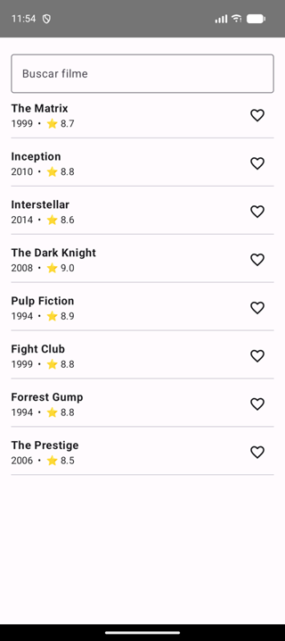
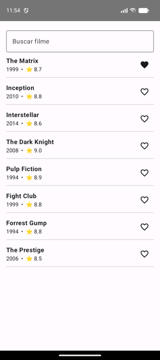
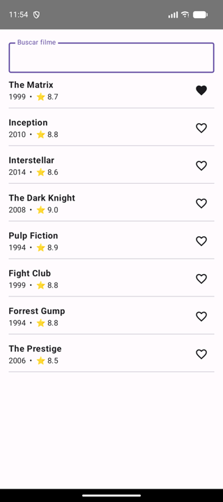
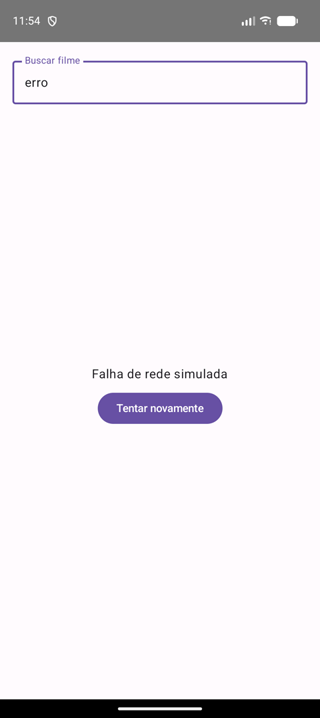

# Desafio: MoviesViewModel

O app (busca de filmes + favoritos) já está pronto: data, domain e a tela Compose.
**Falta só o `MoviesViewModel`**, em
`app/src/main/java/com/example/movies/presentation/MoviesViewModel.kt`.

Você termina quando isto ficar verde:

```bash
./gradlew :app:testDebugUnitTest
```

Não altere os testes nem as outras camadas. Pode perguntar à vontade.

## Como o app está hoje

Ao abrir o app você vê um **loading infinito**: o ViewModel ainda não faz nada.


## Use cases disponíveis

| Use case | Retorno |
|---|---|
| `getPopularMovies()` | `List<Movie>` (suspend) |
| `searchMovies(query)` | `List<Movie>` (suspend) |
| `observeFavoriteIds()` | `Flow<Set<Int>>` |
| `toggleFavorite(id)` | `Unit` (suspend) |

---

## Passo 1: carga inicial e formatação

Ao criar o ViewModel, carregar os populares. Enquanto carrega, `isLoading = true`.
Converter `Movie` em `MovieUi`:

| `Movie` | `MovieUi` |
|---|---|
| `year = 1999` | `year = "1999"` |
| `rating = 8.7` | `rating = "8.7"` ou `"8,7"` (uma casa decimal) |
| | `isFavorite` |

| Carregando | Carregado |
|:---:|:---:|
|  |  |

**Teste:** `carga inicial carrega populares e formata year e rating`

```bash
./gradlew :app:testDebugUnitTest --tests "*carga inicial carrega*"
```

## Passo 2: favoritar

`onToggleFavorite(id)` alterna o favorito. O coração precisa mudar **na lista atual, sem
recarregar da API**.

| Antes | Depois de tocar no coração do Matrix |
|:---:|:---:|
|  |  |

**Testes:** `favoritar marca o filme como favorito na lista` e
`favorito alterado no repositorio reflete na lista`

```bash
./gradlew :app:testDebugUnitTest --tests "*favorit*"
```

## Passo 3: busca

`onQueryChange(query)` atualiza `query` no estado e busca os filmes.
Query em branco volta para os populares.

| Busca `"matrix"` | Query apagada → populares |
|:---:|:---:|
|  |  |

**Testes:** `busca filtra os filmes e atualiza a query no estado` e
`query em branco volta para os populares`

```bash
./gradlew :app:testDebugUnitTest --tests "*busca*" --tests "*query em branco*"
```

## Passo 4: erro e retry

Se o use case lançar exceção: preencher `errorMessage`, sair do loading e não crashar.
`retry()` repete a última operação.

No app, digite **`erro`** na busca para simular uma falha de rede.

| Erro | Tocou em "Tentar novamente" | Refez a busca `"erro"` (falha de novo) |
|:---:|:---:|:---:|
|  |  |  |

**Testes:** `erro na carga inicial expoe mensagem e sai do loading`,
`retry apos erro recarrega com sucesso` e `retry apos erro na busca repete a busca`

```bash
./gradlew :app:testDebugUnitTest --tests "*erro na carga*" --tests "*retry*"
```

---

## O que avaliamos

Clareza ao explicar o raciocínio, modelagem do estado, uso de coroutines/Flow, tratamento
de erro e como você sai da falha pro verde (testando hipóteses, não chutando).
